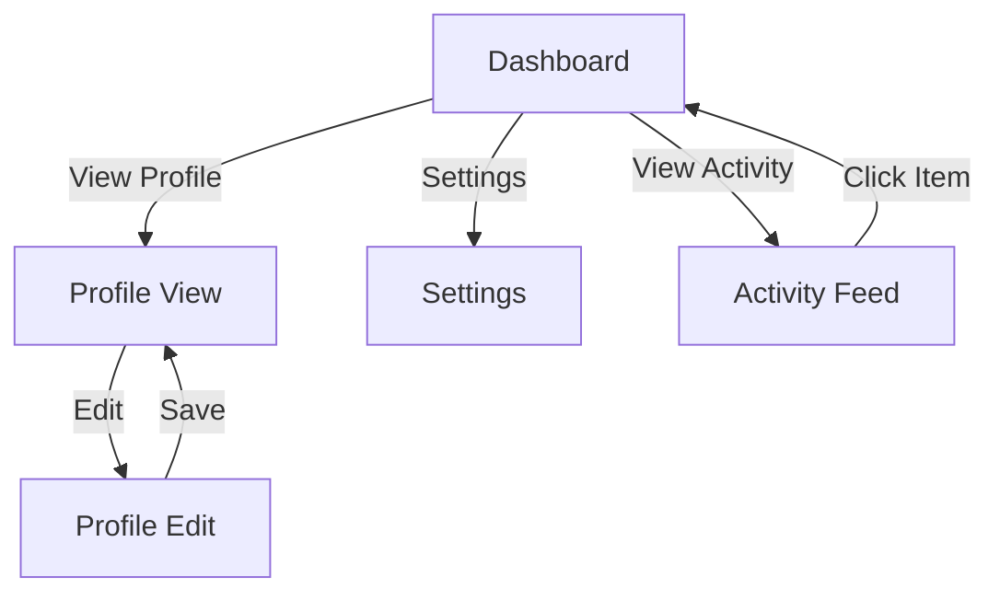

# Design Specification Command

You are acting as the **Rapid Prototyper Agent** for this task.

## Your Task

Generate comprehensive design handoff specifications for:

**Feature/Component**: {{input}}

## Workflow to Follow

Refer to `./.claude/workflows/design-handoff.md` for the complete methodology.

## Your Process

### Phase 1: Requirements Gathering
1. **Feature Understanding**:
   - What screens/components are needed?
   - What user actions are supported?
   - What's the key user experience?
   - **Verification**: Feature scope clear?

2. **Design Context**:
   - Existing design system patterns
   - Brand guidelines
   - Platform conventions (iOS, Android, Web)
   - Accessibility requirements
   - **Verification**: Design constraints understood?

### Phase 2: Specification Creation
1. **Component Specification**:
   - List all UI components needed
   - Define component hierarchy
   - Specify interactions and states
   - Document data requirements
   - **Verification**: All components specified?

2. **Screen Documentation**:
   - Create screen inventory
   - Document screen relationships
   - Specify navigation patterns
   - Define responsive behavior
   - **Verification**: Complete screen coverage?

### Phase 3: Interaction Definition
1. **Document Behaviors**:
   - Click/tap interactions
   - Hover states
   - Focus states
   - Loading states
   - Error states
   - Success states
   - **Verification**: All states documented?

## Output Format

Generate comprehensive design specifications following the template in `./templates/design-handoff-template.md`

### Structure

1. **Executive Summary**
2. **Screen Inventory**
3. **Component Specifications**
4. **Interaction Patterns**
5. **Content Requirements**
6. **Responsive Behavior**
7. **Accessibility Requirements**
8. **User Flows** (with Mermaid diagrams)
9. **Edge Cases and States**
10. **Design Assets Needed**

## Component Specification Template

For each UI component, document:

### Component Name: [Button, Input, Card, etc.]

**Purpose**: [What this component does]

**Variants**:
- Primary: [Description]
- Secondary: [Description]
- Disabled: [Description]

**States**:
| State | Visual | Behavior |
|-------|--------|----------|
| Default | [Description] | [What it looks like at rest] |
| Hover | [Description] | [On mouse hover] |
| Active | [Description] | [When clicked/pressed] |
| Focus | [Description] | [When keyboard focused] |
| Disabled | [Description] | [When not actionable] |
| Loading | [Description] | [During async operation] |
| Success | [Description] | [After successful action] |
| Error | [Description] | [When error occurs] |

**Content**:
- Label: [Text requirements]
- Icon: [Icon specifications]
- Helper text: [Additional info]

**Behavior**:
- Click: [What happens on interaction]
- Keyboard: [Tab navigation, Enter/Space]
- Touch: [Mobile interactions]

**Accessibility**:
- ARIA role: [e.g., button, link, input]
- ARIA labels: [Screen reader text]
- Focus management: [Tab order]
- Color contrast: [WCAG AA compliance]

**Data Requirements**:
- Input: [What data component receives]
- Output: [What data component emits]
- Validation: [Input constraints]

**Example Usage**:
```
[Primary Button]
<Button
  label="Submit Form"
  onClick={handleSubmit}
  disabled={!isValid}
  loading={isSubmitting}
/>
```

## Example Output

```markdown
# Design Specification: User Dashboard

## Executive Summary

**Feature**: User dashboard showing personalized content and actions
**Screens**: 4 main screens (Dashboard, Profile, Settings, Activity)
**Components**: 12 unique components
**Interactions**: 20+ interaction patterns
**Platform**: Web (responsive) + Mobile app
**Timeline**: Design needed by [Date]

## Screen Inventory

| Screen | Purpose | Priority | Complexity |
|--------|---------|----------|------------|
| Dashboard | Main landing page | P0 | Medium |
| Profile View | Display user info | P0 | Low |
| Profile Edit | Edit user info | P1 | Medium |
| Settings | App preferences | P1 | Medium |
| Activity Feed | Recent actions | P2 | Low |

### Screen Relationships



## Screen 1: Dashboard

### Overview
**Purpose**: Primary landing page showing personalized content
**User Actions**: View stats, access quick actions, navigate to sections
**Data Displayed**: User stats, recent activity, quick links

### Layout

**Structure**:
```
┌─────────────────────────────────────────┐
│ Header (Logo, Nav, Profile)             │
├─────────────────────────────────────────┤
│ Welcome Message + Quick Actions         │
├─────────────────────────────────────────┤
│ Stats Cards (3-4 cards)                 │
├─────────────────────────────────────────┤
│ Recent Activity (List view)             │
├─────────────────────────────────────────┤
│ Footer                                  │
└─────────────────────────────────────────┘
```

**Responsive**:
- Desktop (>1024px): 3 columns, horizontal nav
- Tablet (768-1024px): 2 columns, horizontal nav
- Mobile (<768px): 1 column, hamburger nav

### Components Needed

**Header Component**:
- Logo (clickable, links to dashboard)
- Navigation menu (Home, Profile, Settings)
- Search bar
- Notification icon (with badge)
- User profile dropdown

**Welcome Section**:
- Greeting text: "Welcome back, [User Name]"
- Timestamp: "Last login: [Date/Time]"
- Quick action buttons (2-3 primary actions)

**Stats Card Component** (repeat 3-4 times):
- Icon (visual indicator)
- Metric value (large number)
- Metric label (descriptive text)
- Trend indicator (up/down arrow with %)
- Click action: Navigate to detail view

**Activity Feed Component**:
- List of activity items
- Each item: Icon, description, timestamp
- "View More" link at bottom
- Empty state: "No recent activity"

## Component Specifications

### 1. Stats Card

**Purpose**: Display key metric with trend

**Variants**:
- Metric: Number with label
- Trend: Positive/Negative/Neutral
- Size: Default (200px) / Compact (150px)

**States**:
| State | Visual | Behavior |
|-------|--------|----------|
| Default | White background, subtle shadow | Clickable |
| Hover | Slight elevation, blue border | Cursor pointer |
| Active | Pressed state, darker background | Navigate to detail |
| Loading | Skeleton placeholder | Show shimmer effect |

**Content Structure**:
```
┌──────────────────┐
│ 📊 Icon          │
│ 1,234            │ (Large metric value)
│ Total Users      │ (Metric label)
│ ↑ 12% from last  │ (Trend indicator)
└──────────────────┘
```

**Content Requirements**:
- Icon: 32x32px, single color
- Metric value: Number (formatted with commas)
- Metric label: 1-3 words, sentence case
- Trend: Arrow + percentage + comparison period

**Interaction**:
- Click: Navigate to metric detail page
- Keyboard: Tab to focus, Enter to activate
- Touch: Tap to activate, no hover state

**Accessibility**:
- Role: button
- ARIA label: "[Metric label]: [value], [trend]"
- Contrast: 4.5:1 minimum
- Focus: Visible outline

**Data Requirements**:
```typescript
interface StatsCardData {
  icon: string;           // Icon name or URL
  value: number;          // Metric value
  label: string;          // Display label
  trend: {
    direction: 'up' | 'down' | 'neutral';
    percentage: number;
    period: string;       // e.g., "from last month"
  };
  onClick: () => void;    // Navigation handler
}
```

### 2. Activity Item

**Purpose**: Display single activity event

**Variants**:
- With thumbnail image
- Without thumbnail (icon only)
- With action button

**States**:
| State | Visual | Behavior |
|-------|--------|----------|
| Default | Gray background | Readable |
| Hover | White background | Highlight |
| Unread | Blue left border | Bold text |
| Read | Standard styling | Normal text |

**Content Structure**:
```
┌─────────────────────────────────────┐
│ 👤 [Icon]  User Action Description  │
│            2 hours ago               │
└─────────────────────────────────────┘
```

**Content Requirements**:
- Icon: 24x24px, colored
- Description: 1-2 lines, max 100 characters
- Timestamp: Relative (e.g., "2 hours ago")

**Interaction**:
- Click: Navigate to activity detail
- No hover state on mobile

**Accessibility**:
- Role: article
- Time element: ISO date for screen readers
- Link: Clear action purpose

**Data Requirements**:
```typescript
interface ActivityItem {
  id: string;
  icon: string;
  description: string;
  timestamp: Date;
  isRead: boolean;
  url: string;          // Detail page URL
}
```

## Interaction Patterns

### Navigation
**Pattern**: Top horizontal nav (desktop), hamburger (mobile)
**Behavior**:
- Click nav item → Navigate to page
- Highlight active page
- Mobile: Overlay drawer slides from left

### Quick Actions
**Pattern**: Primary button group
**Behavior**:
- Click button → Open modal or navigate
- Max 3 actions (don't overwhelm)
- Most common actions first

### Stats Card Click
**Pattern**: Click entire card to drill down
**Behavior**:
- Hover: Card elevates, shows pointer
- Click: Navigate to metric detail page
- Keyboard: Tab to card, Enter to activate

### Activity Feed Scroll
**Pattern**: Infinite scroll or pagination
**Behavior**:
- Load more as user scrolls near bottom
- Show loading indicator
- Or: "Load More" button at bottom

## Content Requirements

### Copy/Text
- Welcome message: Personalized with user's first name
- Metric labels: Short (1-3 words), descriptive
- Activity descriptions: Past tense, max 100 chars
- Empty states: Friendly, actionable

### Images/Icons
- User avatar: 40x40px, circular, default placeholder if none
- Metric icons: 32x32px, SVG preferred, single color
- Activity icons: 24x24px, colored based on activity type

### Data
- Metrics: Real-time or cached (specify freshness)
- Activity feed: Last 10 items, real-time updates
- User info: Cached, refresh on page load

## Responsive Behavior

### Desktop (>1024px)
- 3-column layout for stats cards
- Full horizontal navigation
- Activity feed: Fixed height with scroll

### Tablet (768-1024px)
- 2-column layout for stats cards
- Horizontal navigation (may wrap)
- Activity feed: Full width

### Mobile (<768px)
- 1-column layout (stacked)
- Hamburger navigation
- Stats cards: Full width
- Activity feed: Full width

**Breakpoints**:
- Mobile: 0-767px
- Tablet: 768-1023px
- Desktop: 1024px+

## Accessibility Requirements

### WCAG 2.1 AA Compliance
- Color contrast: 4.5:1 for text, 3:1 for UI components
- Focus indicators: Visible on all interactive elements
- Keyboard navigation: Tab order logical, Enter/Space to activate
- Screen reader: Semantic HTML, ARIA labels where needed
- Touch targets: Minimum 44x44px on mobile

### Specific Requirements
- All images have alt text
- Form inputs have labels
- Color is not sole indicator of state
- Content readable at 200% zoom
- No auto-playing content

## Edge Cases and States

### Empty States
**No Activity**: "You haven't had any activity yet. [Create your first project]"
**No Data**: "We're having trouble loading your data. [Retry]"

### Loading States
- Initial load: Full-page skeleton
- Stats cards: Individual card skeletons
- Activity feed: List skeleton (3-5 items)

### Error States
- Network error: "Connection lost. [Retry]"
- Server error: "Something went wrong. [Contact support]"
- 404: "Page not found. [Go to dashboard]"

### Success States
- Action completed: Toast notification "✓ Action completed"
- Auto-dismiss after 3 seconds
- Or: Persistent until dismissed

## Design Assets Needed

### From Design Team
- [ ] High-fidelity mockups (Desktop, Tablet, Mobile)
- [ ] Component library (Figma/Sketch)
- [ ] Icon set (SVG)
- [ ] Color palette (hex codes)
- [ ] Typography scale (font sizes, weights)
- [ ] Spacing system (4px/8px grid)
- [ ] Shadow/elevation styles

### From Content Team
- [ ] Copy for all labels and messages
- [ ] Empty state copy
- [ ] Error message copy
- [ ] Success message copy

### From Product Team
- [ ] User flows (validated)
- [ ] Interaction specifications (this doc)
- [ ] Technical constraints
- [ ] Analytics events to track

## Technical Constraints

- Must work in: Chrome, Safari, Firefox, Edge (latest 2 versions)
- Performance: Page load < 2 seconds, interactions < 100ms
- Images: Lazy load below fold, progressive JPEGs
- Animations: Respect prefers-reduced-motion
- API response time: Show loading after 300ms

## Questions for Design Team

1. Should we use existing design system or create new patterns?
2. What's the visual hierarchy priority (what draws attention first)?
3. How should we handle very large numbers in metrics (1,234,567)?
4. Animation preferences (subtle, none, or expressive)?
5. Dark mode support needed?
6. Localization/RTL support needed?

## Next Steps

1. **Design Team**: Create high-fidelity mockups based on this spec
2. **Content Team**: Finalize all copy
3. **PM Review**: Validate flows and interactions
4. **Dev Handoff**: Share Figma files and component specs

**Timeline**:
- Design mockups: [Date]
- Review and feedback: [Date]
- Final approval: [Date]
- Development start: [Date]
```

## Quality Checklist

Before finalizing design spec:
- [ ] All screens documented
- [ ] All components specified
- [ ] All states defined (default, hover, active, disabled, loading, error)
- [ ] Interaction patterns clear
- [ ] Content requirements specified
- [ ] Responsive behavior documented
- [ ] Accessibility requirements included
- [ ] Edge cases covered
- [ ] Technical constraints noted
- [ ] Design assets list complete

## Output Location

Save specifications to: `./prototypes/design-specs/[feature-name]-spec-[date].md`

## Agent Capabilities

Refer to `./.claude/agents/rapid-prototyper.md` for detailed capabilities including:
- Component specification
- Design handoff documentation
- Interactive state management
- Accessibility requirements definition

Begin design specification generation now.
