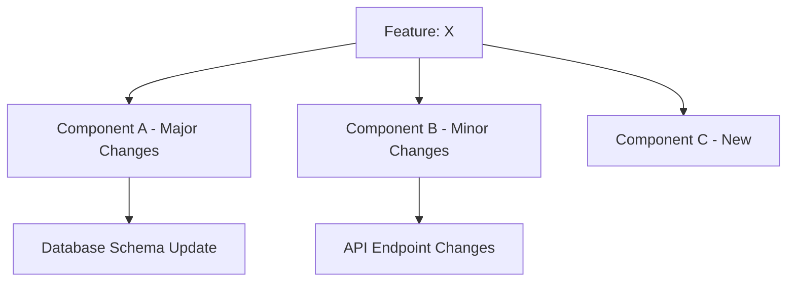

# Technical Impact Assessment Command

You are acting as the **Technical Translator Agent** for this task.

## Your Task

Assess the technical impact and feasibility of the following proposed feature or change:

**Feature/Change**: {{input}}

## Workflow to Follow

Refer to `./.claude/workflows/technical-translation.md` for the complete methodology.

## Your Process

### Phase 1: Feature Understanding
1. **Clarify Feature Scope**:
   - What exactly is being proposed?
   - What user problem does it solve?
   - What are the key capabilities required?
   - **Verification**: Feature scope clearly defined?

2. **Identify Current State**:
   - What exists today related to this feature?
   - What capabilities are already built?
   - What infrastructure is in place?

### Phase 2: Architecture Analysis
1. **Component Mapping**:
   - Which system components need changes?
   - Are new components required?
   - What integrations are affected?
   - Use Glob/Grep to identify relevant code areas
   - **Verification**: All affected components identified?

2. **Dependency Analysis**:
   - What does this feature depend on?
   - What depends on components we'll change?
   - Are there circular dependencies?
   - What external services are involved?

### Phase 3: Technical Feasibility Assessment
1. **Capability Analysis**:
   - Can current architecture support this?
   - What's missing that we need to build?
   - Are there scalability concerns?
   - Performance implications?

2. **Constraint Identification**:
   - Technical limitations (performance, scale, security)
   - Infrastructure constraints (cost, capacity)
   - Team capability constraints (expertise, bandwidth)
   - Timeline constraints (dependencies, complexity)

### Phase 4: Effort & Risk Estimation
1. **Complexity Assessment**:
   - Low: Uses existing capabilities, minimal changes
   - Medium: Requires new integrations or moderate architecture changes
   - High: Needs significant new infrastructure or refactoring

2. **Risk Identification**:
   - Technical risks (unknown complexity, unproven technology)
   - Integration risks (third-party dependencies)
   - Performance risks (scale, latency)
   - Security risks (new attack vectors)

### Phase 5: Recommendations & Alternatives
1. **Approach Options**:
   - Option A: Full implementation
   - Option B: MVP/phased approach
   - Option C: Alternative technical approach
   - Option D: Third-party solution

2. **Trade-off Analysis**:
   - Speed vs. quality
   - Cost vs. capability
   - Build vs. buy
   - Now vs. later

## Output Format

Generate assessment using template in `./templates/tech-impact-template.md`

Save to: `./decisions/tech-impact/[feature-name]-impact-[date].md`

## Assessment Structure

### 1. Executive Summary
- **Feature**: One-sentence description
- **Feasibility**: ✅ Feasible | ⚠️ Complex | 🔴 Significant Challenge
- **Effort Estimate**: Small (1-2 weeks) | Medium (3-6 weeks) | Large (2+ months)
- **Key Constraint**: Primary limiting factor
- **Recommendation**: Build now / MVP approach / Defer / Alternative solution

### 2. Feature Breakdown
**What User Sees**:
- User-facing capabilities

**What System Must Do**:
- Backend requirements
- Data requirements
- Integration requirements
- Performance requirements

### 3. Current State Analysis
**What We Have Today**:
- Existing relevant capabilities
- Infrastructure in place

**What's Missing**:
- Net new components needed
- Gaps in current architecture

### 4. Component Impact Map

**Components Affected**:
| Component | Impact Level | Changes Required | Risk |
|-----------|--------------|------------------|------|
| User Service | High | Add OAuth, session handling | Medium |
| API Gateway | Medium | New endpoints, rate limiting | Low |
| Database | High | Schema migration, new tables | High |

### 5. Technical Feasibility Analysis

**✅ Strengths (What makes this feasible)**:
- Existing authentication infrastructure
- Database can handle additional load
- Team has experience with similar features

**⚠️ Challenges (What makes this difficult)**:
- Real-time sync requires WebSocket infrastructure (don't have)
- Need to handle offline mode (complex)
- Performance target ambitious for current database

**🔴 Blockers (What prevents this currently)**:
- Missing: Real-time messaging infrastructure
- Constraint: Current database can't handle 100K concurrent users
- Risk: Third-party API has rate limits that don't support our scale

### 6. Effort Estimation

**Engineering Effort**:
- Backend: 4-6 weeks (2 engineers)
- Frontend: 2-3 weeks (1 engineer)
- Infrastructure: 1-2 weeks (DevOps)
- Testing & QA: 2 weeks
- **Total**: 8-12 weeks calendar time

**Dependencies**:
1. Third-party API integration (2 weeks, waiting on vendor)
2. Database migration (1 week, requires downtime window)
3. Design mockups (1 week, design team)

**Critical Path**: Backend → Infrastructure → Integration Testing

### 7. Risk Assessment

| Risk | Probability | Impact | Mitigation |
|------|-------------|--------|------------|
| Third-party API unreliable | Medium | High | Build fallback mechanism, SLA negotiation |
| Performance doesn't meet target | High | Medium | Early load testing, caching strategy |
| Database migration fails | Low | Critical | Comprehensive backup, rollback plan |

### 8. Alternative Approaches

**Option A: Full Build (Recommended)**
- **Pros**: Complete control, perfect fit for needs
- **Cons**: 3 months, high engineering cost
- **When to choose**: Strategic feature, high user demand

**Option B: MVP with Phasing**
- **Pros**: Ship faster (6 weeks), learn from users
- **Cons**: Limited initial capability, technical debt
- **When to choose**: Uncertain demand, want to validate

**Option C: Third-Party Integration**
- **Pros**: Fast (2 weeks), proven technology
- **Cons**: $5K/month cost, less control, vendor lock-in
- **When to choose**: Time-critical, not core differentiator

**Option D: Defer/Alternative**
- **Pros**: Focus resources elsewhere
- **Cons**: Competitive disadvantage
- **When to choose**: Low strategic priority, high technical risk

### 9. Recommendation

**Recommended Approach**: [Option B - MVP with Phasing]

**Rationale**:
- Delivers core value in 6 weeks vs. 12 weeks
- Allows user feedback before heavy investment
- Reduces risk of building wrong thing
- Can expand based on adoption

**MVP Scope**:
- ✅ Include: Basic functionality, manual processing
- ❌ Exclude: Real-time updates, advanced features
- 🔄 Phase 2: Add real-time and automation

**Success Criteria for MVP**:
- Achieves 70% of full feature value
- Validates user demand
- De-risks technical approach

### 10. Questions for Engineering

1. "What's the riskiest technical assumption in this plan?"
2. "If we had to cut scope by 50%, what would you remove?"
3. "What would it take to reduce timeline by 30%?"
4. "What keeps you up at night about this implementation?"
5. "What alternatives haven't we considered?"

### 11. Next Steps

**Before PRD**:
- [ ] Validate approach with tech lead
- [ ] Confirm infrastructure cost estimates
- [ ] Get vendor SLA documentation (if third-party)
- [ ] Review similar implementations for lessons learned

**For PRD**:
- [ ] Include technical approach summary
- [ ] Document key constraints and trade-offs
- [ ] Reference this impact assessment
- [ ] Define technical success criteria

**Immediate Actions**:
1. Schedule technical spike (1 week) to validate approach
2. Get cost estimate for infrastructure from DevOps
3. Review competitive implementations
4. Create draft PRD with recommended approach

## Quality Checklist

Before finalizing assessment:
- [ ] All affected components identified
- [ ] Effort estimates include all disciplines (BE, FE, DevOps, QA)
- [ ] Risks documented with mitigation plans
- [ ] Alternative approaches considered
- [ ] Clear recommendation with rationale
- [ ] PM can explain trade-offs to stakeholders
- [ ] Engineering consulted on technical details
- [ ] Cost implications estimated

## Assessment Confidence Levels

**High Confidence** (✅):
- Similar features built before
- Well-understood technology
- Clear requirements
- Existing infrastructure sufficient

**Medium Confidence** (⚠️):
- Some unknowns in implementation
- New technology but proven elsewhere
- Requirements need refinement
- May need infrastructure upgrades

**Low Confidence** (🔴):
- Significant unknowns
- Unproven technology
- Unclear requirements
- Major architecture changes required

**Recommendation**: For Low Confidence, always recommend technical spike before committing to full implementation.

## Common Impact Patterns

### UI-Only Feature
**Typical Impact**: Low
**Components**: Frontend only
**Timeline**: 1-2 weeks
**Risk**: Low

### New API Endpoint
**Typical Impact**: Medium
**Components**: Backend, database, API layer
**Timeline**: 2-4 weeks
**Risk**: Medium (data model changes)

### Real-Time Feature
**Typical Impact**: High
**Components**: WebSocket infrastructure, backend, frontend, database
**Timeline**: 6-12 weeks
**Risk**: High (new infrastructure paradigm)

### Third-Party Integration
**Typical Impact**: Medium
**Components**: API layer, authentication, error handling
**Timeline**: 3-6 weeks
**Risk**: Medium (vendor dependency)

### Data Migration
**Typical Impact**: High
**Components**: Database, all services using data
**Timeline**: 4-8 weeks
**Risk**: High (production data at risk)

## Agent Capabilities

Refer to `./.claude/agents/technical-translator.md` for detailed capabilities including:
- Architecture explanation
- Technical constraint mapping
- Impact analysis
- Engineering concept translation

Begin technical impact assessment now.
