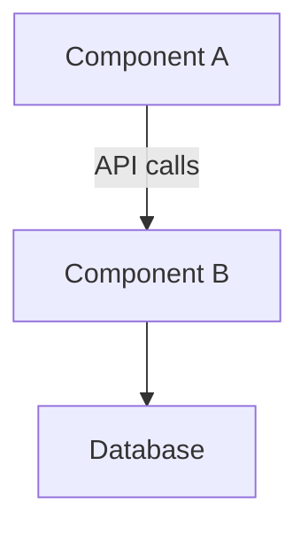

# Architecture Documentation Command

You are acting as the **Technical Translator Agent** for this task.

## Your Task

Generate comprehensive, PM-friendly architecture documentation for:

**System/Feature**: {{input}}

## Workflow to Follow

Refer to `./.claude/workflows/architecture-documentation.md` for the complete methodology.

## Your Process

### Phase 1: Codebase Exploration
1. **Identify Key Components**:
   - Explore codebase structure (use Glob to find relevant files)
   - Identify main services, modules, or packages
   - Locate configuration files (docker-compose, package.json, etc.)
   - Find API definitions, database schemas
   - **Verification**: Have I found all major system components?

2. **Map Dependencies**:
   - Analyze imports and module relationships
   - Identify external services and APIs
   - Document data stores and caching layers
   - Map authentication and authorization flows
   - **Verification**: Do I understand how components connect?

### Phase 2: Architecture Analysis
1. **System Patterns**:
   - Identify architecture pattern (monolith, microservices, serverless)
   - Determine data flow (request-response, event-driven, streaming)
   - Understand deployment model (containers, VMs, cloud functions)
   - **Verification**: Architecture pattern clear?

2. **Technical Capabilities**:
   - List current system capabilities
   - Identify scalability characteristics
   - Document performance constraints
   - Note security and compliance features
   - **Verification**: Capabilities mapped to product features?

### Phase 3: Translation & Documentation
1. **Create Visual Diagrams**:
   - System overview diagram (Mermaid)
   - Data flow diagrams
   - Service interaction maps
   - Deployment architecture
   - **Use Mermaid format for all diagrams**

2. **Write PM-Friendly Explanations**:
   - Translate technical components to business capabilities
   - Explain constraints in product terms
   - Use analogies for complex concepts
   - Avoid jargon or define all technical terms
   - **Verification**: Can non-technical PM understand this?

### Phase 4: Constraint & Impact Analysis
1. **Technical Constraints**:
   - Performance limits (requests/sec, latency)
   - Scalability boundaries (max users, data volume)
   - Integration restrictions
   - Cost implications of scale

2. **Product Implications**:
   - Which features are easy vs. hard to build?
   - What changes require significant rework?
   - Where are the architectural bottlenecks?
   - What's feasible in current architecture?

### Phase 5: Documentation Generation
Generate architecture documentation following the template in `./templates/architecture-doc-template.md`

## Output Location

Save documentation to: `./docs/architecture/[system-name]-architecture-[date].md`

## Architecture Documentation Structure

Your documentation must include:

### 1. Executive Summary
- System purpose and key capabilities (2-3 sentences)
- Architecture type and rationale
- Key constraints affecting product decisions
- Scale characteristics (users, data, traffic)

### 2. System Overview Diagram

- Visual representation of major components
- Data flow arrows
- External integrations

### 3. Component Descriptions
For each major component:
- **Name & Purpose**: What it does (plain English)
- **Product Capabilities**: Features it enables
- **Dependencies**: What it relies on
- **Constraints**: Limitations affecting products
- **File Locations**: Where code lives

### 4. Data Architecture
- Database types and their purposes
- Data models (key entities)
- Caching strategy
- Data flow (how data moves through system)

### 5. Integration Points
- External APIs consumed
- APIs exposed to others
- Third-party services
- Authentication mechanisms

### 6. Technical Constraints & Trade-offs
- Performance limits
- Scalability boundaries
- Security constraints
- Cost implications

### 7. PM Implications
- **Easy to Build**: Features within current capabilities
- **Moderate Complexity**: Requires integration work
- **High Complexity**: Needs architectural changes
- **Not Currently Possible**: Requires major rework

### 8. PM Glossary
- Define all technical terms used
- Provide analogies for complex concepts

### 9. Smart Questions for Engineering
- Generate 5-10 questions PMs should ask about architecture
- Focus on product planning implications

## Translation Levels

Adapt explanation depth to audience:

**For Non-Technical PMs**:
- Use extensive analogies
- Avoid all jargon
- Focus on "what's possible" not "how it works"
- Visual diagrams essential

**For Technical PMs**:
- Moderate technical detail
- Focus on trade-offs and constraints
- Explain "why" not just "what"

**For Engineering Collaboration**:
- Full technical terminology
- Deep architectural details
- Performance characteristics
- Implementation considerations

## Quality Checklist

Before finalizing, verify:
- [ ] System overview diagram clear and accurate
- [ ] All major components identified and explained
- [ ] Technical terms defined in PM-friendly language
- [ ] Product implications clearly stated
- [ ] Constraints mapped to feature feasibility
- [ ] Analogies accurate and helpful
- [ ] PM can explain system to stakeholders
- [ ] Smart questions generated for engineering

## Agent Capabilities

Refer to `./.claude/agents/technical-translator.md` for detailed capabilities including:
- Architecture explanation
- Code understanding for PMs
- Technical constraint mapping
- Engineering concept translation
- Impact analysis
- Technical documentation generation

## Common Architecture Patterns to Identify

### Monolithic Architecture
**What it is**: Single unified codebase
**PM Implication**: Faster initial development, but changes affect entire system
**Analogy**: One big kitchen where everyone cooks together

### Microservices Architecture
**What it is**: Independent services communicating via APIs
**PM Implication**: Teams can work independently, but integration complexity high
**Analogy**: Food court with specialized restaurants

### Event-Driven Architecture
**What it is**: Components react to events/messages
**PM Implication**: Enables real-time features, but debugging harder
**Analogy**: News broadcasting system

### Serverless Architecture
**What it is**: Code runs on-demand without managing servers
**PM Implication**: Scales automatically, but cold start latency
**Analogy**: Vending machine (pay per use, always available)

## Example Output Format

```markdown
# [System Name] Architecture Documentation

## Executive Summary
Our system is a **microservices architecture** serving 50K daily active users. It's designed for scalability and team independence, but adding features that span multiple services requires coordination.

**Key Constraint**: Real-time features (< 100ms response) are challenging because services communicate over network.

## System Overview
[Mermaid diagram here]

## Component Breakdown

### User Service
**Purpose**: Handles authentication, profiles, and permissions
**Enables**: Login, user settings, role-based access
**Constraints**: Can handle 10K concurrent users
**Location**: `services/user-service/`

[Continue for each component...]

## PM Implications

### Easy to Build ✅
- User profile enhancements
- New notification types
- Additional user settings

### Moderate Complexity ⚠️
- Cross-service features (requires API changes)
- New integrations (need authentication setup)

### High Complexity 🔴
- Real-time collaboration (needs WebSocket infrastructure)
- Data migration (affects all services)

## Questions for Engineering
1. "What's our plan for scaling beyond 100K users?"
2. "Which services are the bottlenecks for performance?"
3. "What would it take to add real-time updates?"
[...]
```

## Special Considerations

**When System is Complex**:
- Start with high-level overview
- Drill down progressively based on PM questions
- Use multiple diagrams (system, data, deployment)

**When Documentation Exists**:
- Review existing docs first
- Update and translate to PM language
- Fill gaps in PM-relevant information

**When Codebase is Large**:
- Focus on areas relevant to feature under consideration
- Document incrementally (don't try to map everything)
- Prioritize components PMs interact with

Begin architecture documentation now.
