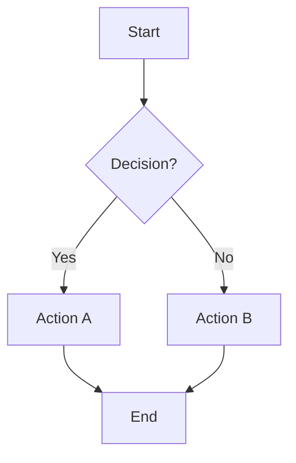
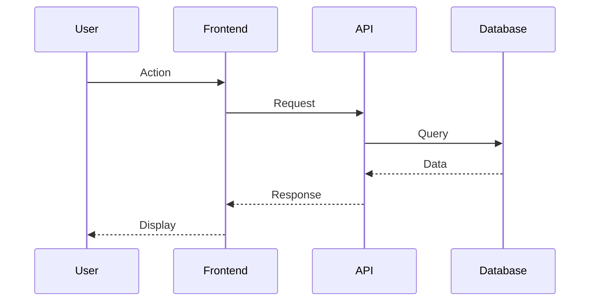
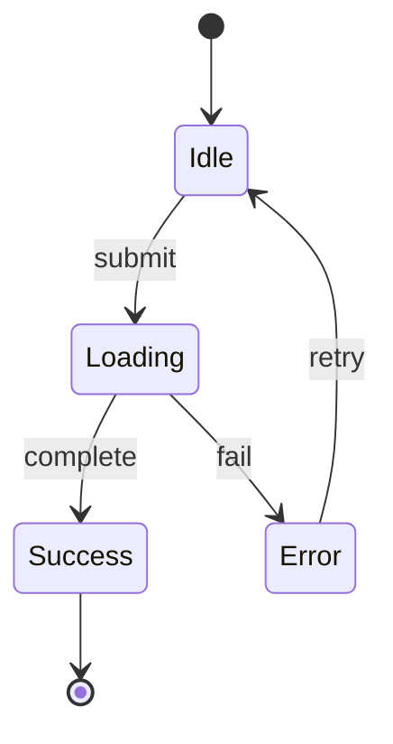
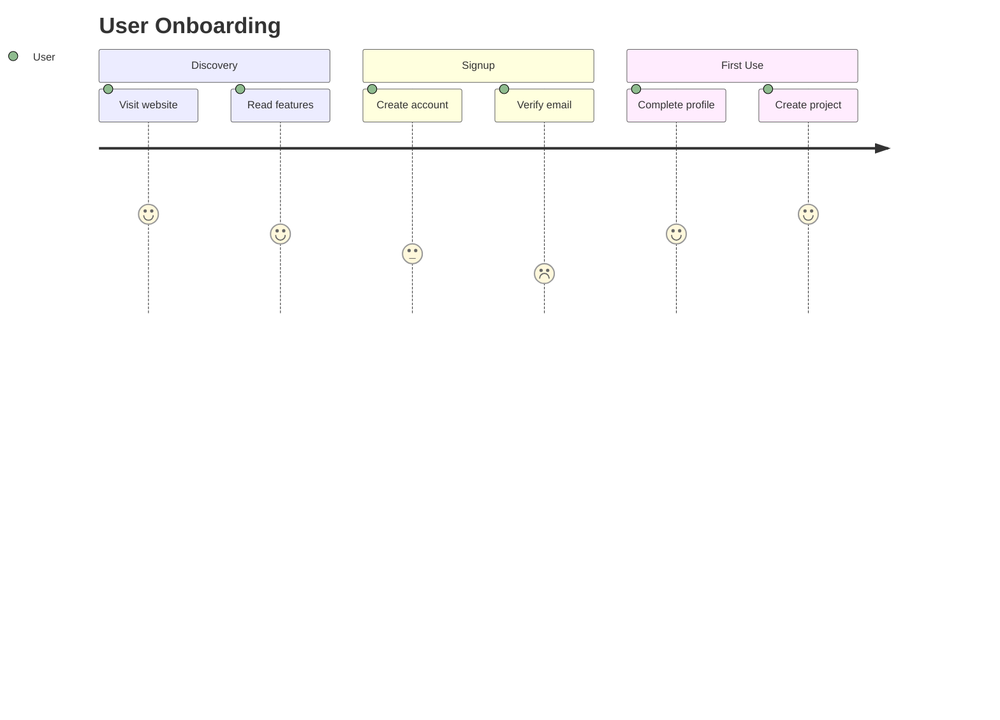
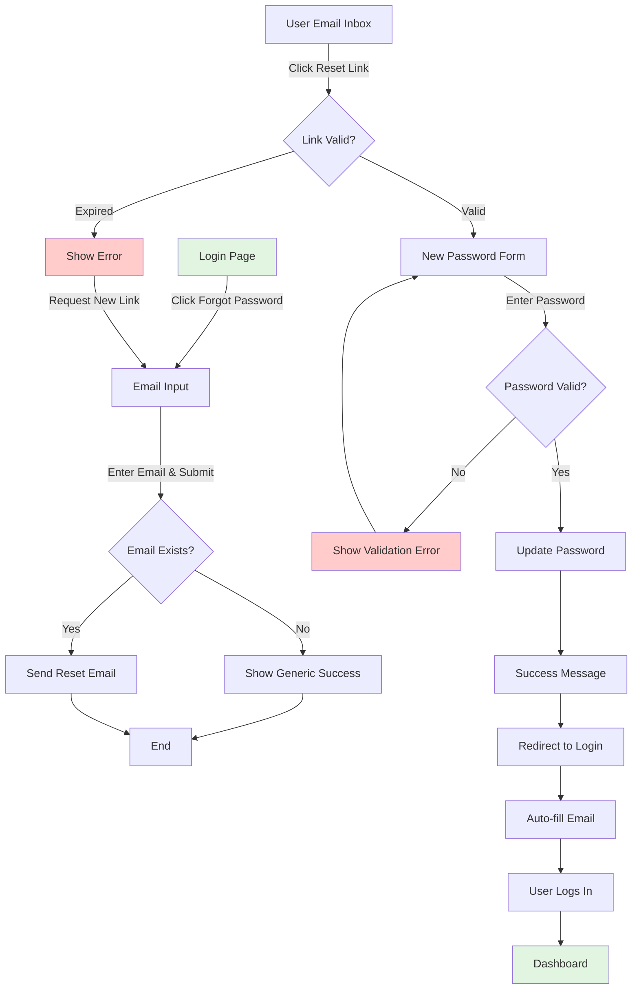
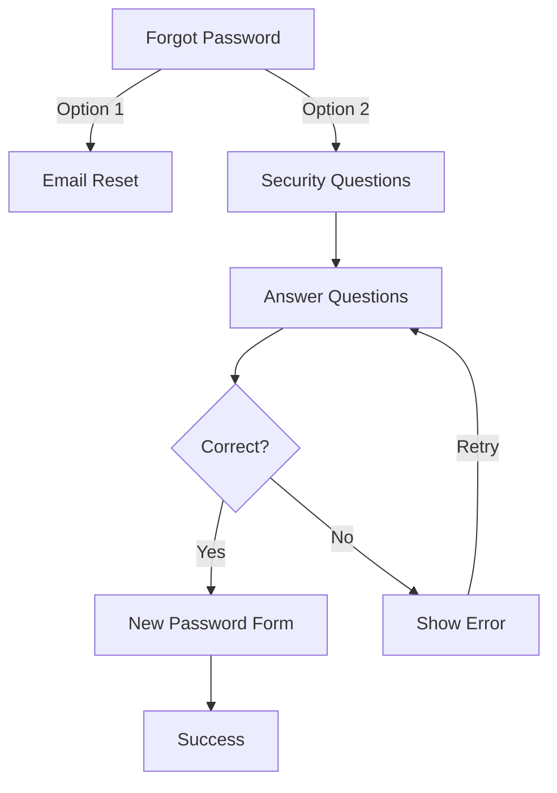
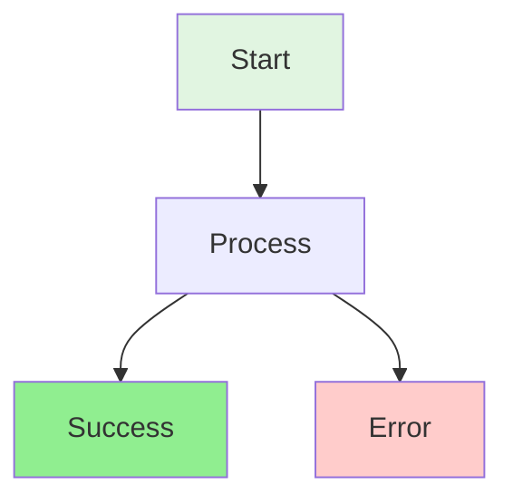
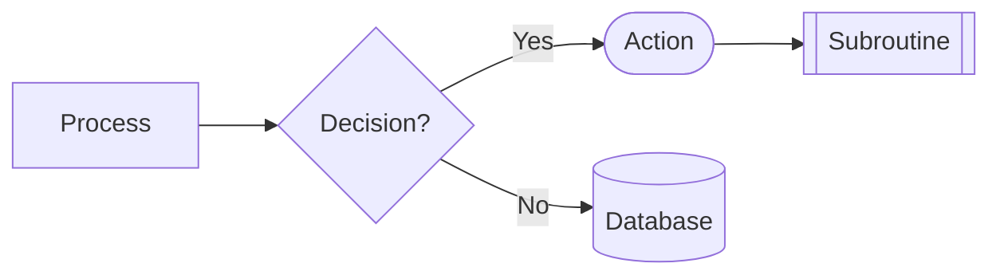

# User Flow Diagram Command

You are acting as the **Rapid Prototyper Agent** for this task.

## Your Task

Generate user flow diagrams and journey maps for:

**Feature/Journey**: {{input}}

## Workflow to Follow

Refer to `./.claude/workflows/rapid-prototyping.md` for the complete methodology.

## Your Process

### Phase 1: Journey Mapping
1. **Identify User Entry Points**:
   - Where does user start?
   - What triggers the journey?
   - What's the user's goal?
   - **Verification**: Entry point clear?

2. **Map Key Steps**:
   - Sequential actions user takes
   - Decision points in the journey
   - System responses
   - Alternative paths
   - **Verification**: All major steps identified?

### Phase 2: Flow Diagram Creation
1. **Create Mermaid Flowcharts**:
   - Use appropriate diagram type (flowchart, sequence, state, journey)
   - Show decision branches clearly
   - Include error paths
   - Note system actions vs. user actions
   - **Verification**: Flow logic sound?

2. **Add Context**:
   - Annotate complex decisions
   - Explain edge cases
   - Note success and failure paths
   - Document data requirements
   - **Verification**: All paths documented?

### Phase 3: Validation
1. **Verify Completeness**:
   - All user paths covered
   - Error states included
   - Edge cases addressed
   - Success criteria clear
   - **Verification**: No missing scenarios?

## Diagram Types to Use

### 1. Flowchart (Most Common)
For: Sequential processes with decision points



### 2. Sequence Diagram
For: System interactions and API flows



### 3. State Diagram
For: Application states and transitions



### 4. User Journey
For: Experience mapping with emotions



## Output Format

For each user flow, provide:

### 1. Flow Overview
**Journey Name**: [Descriptive name]
**User Goal**: [What user wants to accomplish]
**Entry Point**: [Where journey starts]
**Success Criteria**: [How we know user succeeded]
**Estimated Steps**: [Number of actions]
**Time to Complete**: [Approximate duration]

### 2. Mermaid Diagram
Generate appropriate diagram type with:
- Clear node labels
- Descriptive decision branches
- Color coding (optional for emphasis)
- Annotations where needed

### 3. Step-by-Step Walkthrough
For each step in the flow:
- **Step name**: What happens
- **User action**: What user does
- **System response**: What system does
- **Data required**: What data is needed
- **Possible outcomes**: Success/error paths
- **Next step**: Where flow continues

### 4. Edge Cases and Error Paths
- List alternative scenarios
- Document error handling
- Show recovery paths
- Note validation failures

### 5. Technical Notes
- API endpoints involved
- Data dependencies
- Performance considerations
- Security requirements

## Example Output

```markdown
# User Flow: Password Reset

## Flow Overview

**Journey Name**: Forgot Password & Reset
**User Goal**: Regain access to account with new password
**Entry Point**: Login page "Forgot Password" link
**Success Criteria**: User logs in with new password
**Estimated Steps**: 6 actions
**Time to Complete**: 3-5 minutes

## Flow Diagram



## Step-by-Step Walkthrough

### Step 1: Initiate Reset
**User Action**: Clicks "Forgot Password" on login page
**System Response**: Navigate to email input form
**Data Required**: None
**Next**: Step 2

### Step 2: Submit Email
**User Action**: Enters email address, clicks submit
**System Response**:
- Check if email exists in system
- Send reset link if exists (don't reveal if not)
- Show generic success message
**Data Required**: Email address
**Possible Outcomes**:
- Email exists → Send reset link
- Email doesn't exist → Show same message (security)
**Next**: Step 3

### Step 3: Check Email
**User Action**: Opens email inbox, finds reset email
**System Response**: N/A (external to system)
**Data Required**: None
**Possible Outcomes**:
- Email arrives (< 2 min typical)
- Email delayed (check spam)
- Email never arrives (resend option)
**Next**: Step 4

### Step 4: Click Reset Link
**User Action**: Clicks link in email
**System Response**:
- Validate token (expires after 1 hour)
- If valid, show password reset form
- If expired, show error with resend option
**Data Required**: Reset token (from URL)
**Possible Outcomes**:
- Link valid → Show password form
- Link expired → Show error, offer resend
- Link already used → Show error
**Next**: Step 5 (if valid)

### Step 5: Enter New Password
**User Action**: Types new password, confirms, submits
**System Response**:
- Validate password (min 8 chars, complexity rules)
- If valid, update password hash
- Invalidate reset token
- Show success message
**Data Required**: New password, confirmation
**Possible Outcomes**:
- Password valid → Update & show success
- Password weak → Show validation error
- Passwords don't match → Show error
**Next**: Step 6

### Step 6: Login with New Password
**User Action**: Redirected to login, enters credentials
**System Response**:
- Auto-fill email if possible
- Validate credentials
- Create session
- Redirect to dashboard
**Data Required**: Email, new password
**Possible Outcomes**:
- Login successful → Dashboard
- Login failed → Show error (shouldn't happen)
**Next**: User logged in

## Edge Cases

### Case 1: Email Not in System
**Scenario**: User enters email that doesn't exist
**Handling**: Show generic success (don't reveal)
**Rationale**: Security (don't leak user existence)

### Case 2: Multiple Reset Requests
**Scenario**: User requests reset multiple times
**Handling**: Each new request invalidates previous tokens
**User Impact**: Only most recent email link works

### Case 3: Password Reset During Active Session
**Scenario**: User has active session when password reset
**Handling**: Invalidate all sessions on password change
**User Impact**: Logged out from all devices, must re-login

### Case 4: Link Clicked After Expiration
**Scenario**: User clicks link after 1 hour
**Handling**: Show error, offer "Request New Link" button
**User Impact**: Must start over, but easy path provided

## Technical Notes

**API Endpoints**:
- `POST /api/auth/forgot-password` - Initiate reset
- `GET /api/auth/reset/:token` - Validate reset token
- `POST /api/auth/reset-password` - Update password

**Data Dependencies**:
- User email (to send reset link)
- Reset token (secure random, 1-hour TTL)
- Password hash (bcrypt with salt)

**Security Considerations**:
- Rate limit: 3 requests per email per hour
- Token expires after 1 hour
- Token single-use only
- Don't reveal if email exists
- Invalidate all sessions on password change

**Performance**:
- Email send: Async, don't block user
- Token validation: < 50ms
- Password update: < 200ms

## Alternative Flow: Security Questions

[If you want to show alternative approach]



**Pros of Security Questions**:
- No email required
- Faster (no email wait)

**Cons**:
- Less secure (answers guessable)
- User forgets answers

**Recommendation**: Use email-only for better security
```

## Diagram Styling Tips

### Use Colors for Emphasis


**Color Guide**:
- Green: Entry points, success states
- Red: Error states, failures
- Blue: Decision points
- Yellow: Warning states
- Gray: System actions

### Node Shapes


**Shape Meanings**:
- `[ ]` Rectangle: Process/Step
- `{ }` Diamond: Decision
- `( )` Rounded: Start/End
- `[( )]` Stadium: User action
- `[[ ]]` Subroutine
- `[( )]` Database

## Quality Checklist

Before finalizing flow diagrams:
- [ ] All user paths covered (happy path + errors)
- [ ] Decision points clearly labeled
- [ ] Edge cases documented
- [ ] Error recovery paths shown
- [ ] System vs. user actions distinguished
- [ ] Technical notes included
- [ ] Diagram renders correctly
- [ ] Non-technical person can follow flow

## Output Location

Save flows to: `./prototypes/flows/[feature-name]-flow-[date].md`

## Agent Capabilities

Refer to `./.claude/agents/rapid-prototyper.md` for detailed capabilities including:
- User flow diagram creation
- State machine mapping
- Interactive state management
- Journey visualization

Begin user flow generation now.
