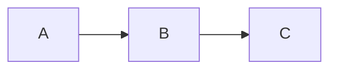
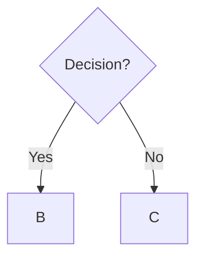
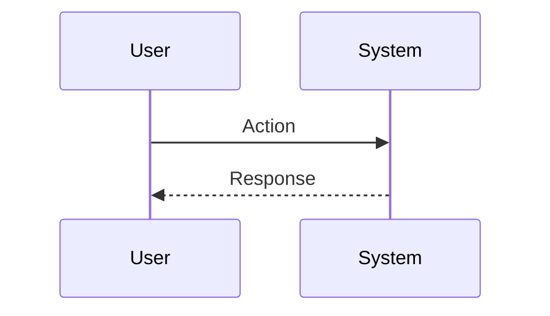

# Rapid Prototyping Workflow

## Long-CoT Rapid Prototyping Framework

This workflow enables PMs to quickly generate low-fidelity prototypes (ASCII wireframes, Mermaid diagrams) to facilitate discussions, gather feedback, and align stakeholders without requiring design tools or technical skills.

## Phase 1: Feature Understanding

### Step 1.1: Scope Definition
- Identify what feature/flow needs to be prototyped
- Define user goals and key actions
- Determine primary user persona
- List expected screens or states
- **Verification**: Clear understanding of what to prototype?

### Step 1.2: Context Gathering
- Review existing research or requirements
- Understand technical constraints
- Identify similar patterns in product
- Note brand/design guidelines if applicable
- **Verification**: Sufficient context to begin prototyping?

### Step 1.3: Fidelity Selection
Choose appropriate fidelity level:
- **Concept**: Quick boxes and arrows (5-10 min)
- **Wireframe**: Detailed layout with components (30-60 min)
- **Flow**: User journey with Mermaid (1-2 hours)
- **Spec**: Complete design handoff (2-4 hours)
- **Verification**: Fidelity matches purpose and timeline?

## Phase 2: Wireframe Creation

### Step 2.1: Screen Inventory
- List all screens/views needed
- Determine screen hierarchy
- Identify entry and exit points
- Note screen relationships
- **Verification**: Complete screen coverage?

### Step 2.2: Component Identification
For each screen, identify:
- Navigation elements (header, menu, tabs)
- Content areas (main content, sidebars)
- Input elements (forms, search, filters)
- Action elements (buttons, links)
- Feedback elements (messages, notifications)
- **Verification**: All UI elements identified?

### Step 2.3: ASCII Wireframe Generation
- Use box-drawing characters for structure
- Include clear labels for all elements
- Show content hierarchy with spacing
- Use placeholder content appropriately
- Maintain consistent formatting
- **Verification**: Wireframes clear and readable?

## Phase 3: User Flow Documentation

### Step 3.1: Journey Mapping
- Identify user entry point
- List sequential steps user takes
- Note decision points in journey
- Map alternative paths
- Include error and success end states
- **Verification**: Complete user journey mapped?

### Step 3.2: Mermaid Diagram Creation
Choose appropriate diagram type:
- **Flowchart**: Sequential process with decisions
- **Sequence**: System interactions
- **State**: Application state transitions
- **Journey**: Experience with emotions
- Generate diagram with clear labels
- **Verification**: Diagram type fits the flow?

### Step 3.3: Path Validation
- Verify happy path completeness
- Check error path handling
- Validate edge case coverage
- Ensure all decision branches have outcomes
- **Backtracking Point**: If paths incomplete, return to Step 3.1

## Phase 4: Interaction Specification

### Step 4.1: Element Behavior Definition
For each interactive element:
- Default state appearance
- Hover state (desktop)
- Active/pressed state
- Focused state (keyboard)
- Disabled state (if applicable)
- Loading state (if applicable)
- **Verification**: All states defined?

### Step 4.2: Data Requirements
- Identify data displayed in each component
- Specify data sources (API, user input, static)
- Note data validation rules
- Document data dependencies
- **Verification**: Data requirements clear?

### Step 4.3: Responsive Behavior
- Define desktop layout (>1024px)
- Define tablet layout (768-1024px)
- Define mobile layout (<768px)
- Note key differences per breakpoint
- **Verification**: Responsive strategy clear?

## Phase 5: Annotation and Context

### Step 5.1: Add Explanatory Notes
- Annotate complex interactions
- Explain non-obvious behaviors
- Note technical considerations
- Document business logic
- Highlight open questions
- **Verification**: All ambiguities clarified?

### Step 5.2: Edge Case Documentation
Document handling for:
- Empty states (no data)
- Loading states (fetching data)
- Error states (failure conditions)
- Success states (completed actions)
- Validation failures (invalid input)
- **Verification**: All states covered?

### Step 5.3: Success Criteria Definition
- What makes this prototype "good enough"?
- What feedback are you seeking?
- What decisions does this inform?
- What's the next step after this?
- **Verification**: Clear prototype purpose?

## Phase 6: Review and Iteration

### Step 6.1: Self-Review
Check prototype for:
- Completeness (all screens/flows covered)
- Clarity (understandable without explanation)
- Consistency (patterns used uniformly)
- Feasibility (technically possible)
- Alignment (matches requirements)
- **Verification**: Prototype ready for review?

### Step 6.2: Stakeholder Feedback
Share with:
- Engineering (technical feasibility)
- Design (UX patterns and flow)
- Product team (requirements alignment)
- Users (if applicable, for early validation)
- Collect feedback systematically
- **Verification**: Feedback gathered and documented?

### Step 6.3: Rapid Iteration
- Implement quick wins immediately
- Prioritize critical feedback
- Create alternative versions if needed
- Re-share updated version
- **Backtracking Point**: If major feedback, return to appropriate phase

## Phase 7: Handoff Preparation

### Step 7.1: Documentation Packaging
Prepare complete package:
- All wireframes in single document
- User flows with Mermaid diagrams
- Interaction specifications
- Edge case documentation
- Open questions list
- **Verification**: Complete documentation set?

### Step 7.2: Next Steps Definition
Specify what happens next:
- If design needed: Handoff to design team
- If engineering: Include in tech spec
- If validation: Plan user testing
- If approval: Include in PRD
- **Verification**: Clear next actions?

### Step 7.3: Archive and Version
- Save prototype with clear naming
- Note version and date
- Link to related documents (PRD, research)
- Tag key stakeholders
- Store in appropriate location
- **Verification**: Findable and accessible?

## Error Correction Mechanisms

### Automatic Detection
- **Incomplete flows**: Alert if flow has dead ends
- **Missing states**: Warn if interactive elements lack state definitions
- **Inconsistent patterns**: Flag when similar elements differ
- **Unlabeled diagrams**: Detect Mermaid diagrams without titles

### Manual Review Checkpoints
- Phase 3 completion: User flow validation
- Phase 5 completion: Annotation completeness check
- Phase 6 completion: Stakeholder sign-off
- Phase 7 completion: Handoff readiness review

## Output Artifacts

1. **ASCII Wireframes** (`./prototypes/mockups/[feature]-mockup-[date].md`)
   - Screen layouts
   - Component annotations
   - Interaction notes

2. **User Flow Diagrams** (`./prototypes/flows/[feature]-flow-[date].md`)
   - Mermaid flowcharts
   - Journey maps
   - State diagrams

3. **Interaction Specifications** (`./prototypes/specs/[feature]-interactions-[date].md`)
   - Component behaviors
   - State definitions
   - Data requirements

4. **Prototype Summary** (`./prototypes/[feature]-prototype-[date].md`)
   - Complete package
   - All artifacts combined
   - Next steps documented

## Integration Points

- **Feeds into PRD Framework**: Visual representations for requirements
- **Supports Design Handoff**: Specifications for designers
- **Enables User Testing**: Low-fi prototypes for validation
- **Informs Technical Specs**: Implementation guidance
- **Facilitates Stakeholder Alignment**: Discussion materials

## Success Criteria

- Stakeholders understand feature vision without lengthy explanation
- Engineering can estimate complexity from prototype
- Design has clear starting point
- Users can validate concepts (if tested)
- Reduces design revision cycles
- Accelerates feature discussions
- Surfaces questions and edge cases early

## Prototyping Speed Guidelines

### 5-Minute Prototype (Concept Sketch)
**Use for**: Quick brainstorming, early exploration
**Output**: Simple boxes and arrows
**Example**:
```
[Screen A] → [Screen B] → [Screen C]
```

### 30-Minute Prototype (Wireframe)
**Use for**: Stakeholder alignment, initial specs
**Output**: Detailed ASCII wireframes
**Focus**: Layout and structure, not pixel-perfect

### 1-Hour Prototype (Flow + Wireframes)
**Use for**: User testing prep, engineering discussions
**Output**: Complete user journey with key screens
**Focus**: Full flow coverage, edge cases

### 2-Hour Prototype (Design Spec)
**Use for**: Designer handoff, development ready
**Output**: Complete specifications
**Focus**: All states, interactions, responsive behavior

## Common Prototyping Patterns

### Pattern 1: List → Detail
```
┌─────────────┐         ┌──────────────┐
│ Item List   │ Click   │ Item Detail  │
│ • Item 1  →│────────→│ [Full info]  │
│ • Item 2    │         │ [Actions]    │
└─────────────┘         └──────────────┘
```

### Pattern 2: Form → Confirmation
```
┌─────────────┐         ┌──────────────┐
│ Input Form  │ Submit  │ Confirmation │
│ [_____]     │────────→│ ✓ Success!   │
│ [_____]     │         │ [Next Step]  │
│ [Submit]    │         └──────────────┘
└─────────────┘
```

### Pattern 3: Multi-Step Wizard
```
Step 1 → Step 2 → Step 3 → Complete
  ●       ○        ○         ○
```

### Pattern 4: Modal Dialog
```
      ┌──────────────┐
      │ Confirm?     │
      │ [Yes] [No]   │
      └──────────────┘
           ↓
    [Action taken]
```

## Rapid Iteration Techniques

### Technique 1: Side-by-Side Alternatives
Show multiple options in single document:
```
Option A: Tabs          Option B: Dropdown
┌─────────────┐        ┌──────────────┐
│ Tab1  Tab2  │        │ [Select▼]    │
└─────────────┘        └──────────────┘

Pros: Visible          Pros: Compact
Cons: More space       Cons: Hidden options
```

### Technique 2: Progressive Enhancement
Start simple, layer complexity:
1. Core flow (MVP)
2. Add error handling
3. Add edge cases
4. Add advanced features

### Technique 3: Before/After
Show current vs. proposed:
```
Current                New Design
┌─────────┐           ┌─────────────┐
│ Old Way │           │ Better Way  │
└─────────┘           └─────────────┘
```

### Technique 4: Annotation Layers
1. Base wireframe (clean)
2. Add interaction annotations
3. Add data requirements
4. Add technical notes

## Tools and Techniques

### ASCII Art Resources
**Box Drawing Characters**:
```
┌─┬─┐  ╔═╦═╗  ╭─┬─╮
│ │ │  ║ ║ ║  │ │ │
├─┼─┤  ╠═╬═╣  ├─┼─┤
│ │ │  ║ ║ ║  │ │ │
└─┴─┘  ╚═╩═╝  ╰─┴─╯
```

**UI Symbols**:
```
Buttons: [Button] <Secondary> {Icon}
Inputs:  [_______] [•••••••] [▼Select]
Checks:  ☐ ☑ ✓ ✗ ○ ●
Icons:   ⚙ 🔍 ✎ ⋮ ☰ ✕ ✓ ⚠
Arrows:  → ← ↑ ↓ ⇒ ⇐ ⇑ ⇓
```

### Mermaid Diagram Quick Reference
**Flowchart**:


**Decision Tree**:


**Sequence**:


## Quality Checklist

**Completeness**:
- [ ] All screens/views prototyped
- [ ] User flows start-to-finish
- [ ] Edge cases documented
- [ ] Error states specified
- [ ] Loading states defined

**Clarity**:
- [ ] Labels descriptive
- [ ] Interactions obvious or annotated
- [ ] Data requirements specified
- [ ] Navigation clear
- [ ] Non-technical person can understand

**Consistency**:
- [ ] Similar patterns used uniformly
- [ ] Terminology consistent
- [ ] Visual hierarchy maintained
- [ ] Spacing and alignment clean

**Actionability**:
- [ ] Designer can create high-fi from this
- [ ] Engineer can estimate complexity
- [ ] Stakeholder can provide feedback
- [ ] User can validate (if tested)

## Continuous Improvement

Improve prototyping process through:
- Building reusable component library
- Documenting effective patterns
- Learning from stakeholder feedback
- Refining fidelity selection criteria
- Tracking prototype→design→build quality
- Measuring time savings vs. traditional methods

## Related Frameworks
- Paper Prototyping (Carolyn Snyder)
- Lean UX (Jeff Gothelf & Josh Seiden)
- Design Sprint (Jake Knapp, Google Ventures)
- Wireframing Best Practices
- User Story Mapping (Jeff Patton)
