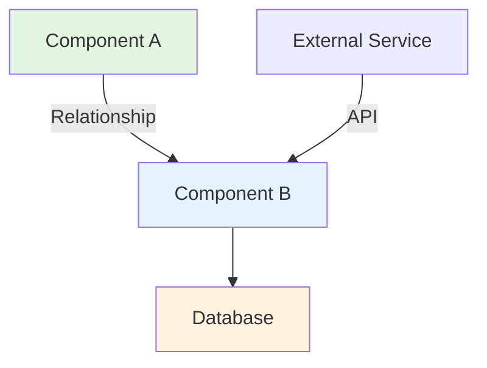
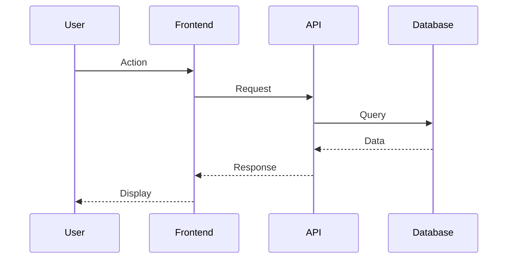

# Architecture Documentation: [System/Feature Name]

**PM Author**: [Your Name]
**Created**: [Date]
**Last Updated**: [Date]
**Engineering Reviewer**: [Engineer Name]
**Status**: [Draft | Reviewed | Approved]

---

## Executive Summary

**System Purpose**: [What does this system do? 2-3 sentences in plain English]

**Architecture Type**: [Monolithic | Microservices | Serverless | Hybrid]

**Scale**:
- Daily Active Users: [Number]
- Requests per day: [Number]
- Data volume: [Size]

**Key Constraint**: [Most important technical limitation affecting product decisions]

---

## System Overview Diagram

**Diagram Key**:
- 🟢 Green: Frontend/User-facing
- 🔵 Blue: Backend services
- 🟡 Yellow: Data storage
- ⚪ White: External services

---

## Components

### [Component Name 1]

**What It Does**: [Plain English description]

**Product Capabilities**:
- [Feature 1 this enables]
- [Feature 2 this enables]

**Dependencies**:
- Depends on: [What it needs]
- Used by: [What uses this]

**Technical Constraints**:
- Performance: [e.g., "Can handle 10K concurrent users"]
- Scale limit: [e.g., "Database maxes at 1TB"]
- Cost: [e.g., "$500/month at current scale"]

**Change Complexity**: [Easy | Moderate | High]

**File Location**: `[path/to/component]`

---

### [Component Name 2]

[Repeat structure for each major component]

---

## Data Architecture

### Databases

| Database | Type | Purpose | Size | Performance |
|----------|------|---------|------|-------------|
| [Name] | [PostgreSQL, MongoDB, Redis] | [What data it stores] | [GB/TB] | [queries/sec] |

### Key Data Models

**[Entity Name]** (e.g., User, Order, Product)
- Purpose: [Why this data exists]
- Key fields: [Important attributes]
- Relationships: [Connected to what other entities]
- Product impact: [Which features depend on this]

### Data Flow

---

## Integration Points

### External APIs We Use

| Service | Purpose | Dependency Level | Fallback |
|---------|---------|------------------|----------|
| [Name] | [What it does for us] | [Critical/Important/Optional] | [What happens if it fails] |

**Example**:
| Stripe | Payment processing | Critical | No payments possible |
| SendGrid | Email delivery | Important | Queue for later |
| Analytics API | Usage tracking | Optional | Continue without tracking |

### APIs We Expose

| Endpoint | Purpose | Who Uses It | Rate Limit |
|----------|---------|-------------|------------|
| `/api/users` | User data access | Mobile app, Web app | 1000 req/min |

---

## Technical Constraints & PM Implications

### Performance

**Current**: [e.g., "Page loads in 2 seconds, API responds in 200ms"]
**Limit**: [e.g., "Database queries slow down above 100K users"]
**PM Implication**: [e.g., "Need to plan database upgrade before reaching 80K users"]

### Scalability

**Current Capacity**: [e.g., "Can handle 50K daily active users"]
**Growth Limit**: [e.g., "Need infrastructure upgrade at 75K users"]
**Cost at Scale**: [e.g., "Each additional 10K users costs $2K/month"]
**PM Implication**: [e.g., "Plan infrastructure costs into pricing model"]

### Security

**Current Measures**: [e.g., "SSL, authentication, rate limiting"]
**Limitations**: [e.g., "No 2FA, no role-based access control"]
**PM Implication**: [e.g., "Enterprise customers require 2FA - needs development"]

### Reliability

**Uptime**: [e.g., "99.9% uptime target (43 minutes downtime/month)"]
**Failure Modes**: [e.g., "If payment service down, orders queued"]
**PM Implication**: [e.g., "Users can continue browsing but not checkout during outages"]

---

## Feature Feasibility Guide

### ✅ Easy to Build (1-2 weeks)
Features that use existing infrastructure without major changes:
- [Example feature 1]
- [Example feature 2]
- [Example feature 3]

**Characteristics**: UI changes, new endpoints, simple CRUD operations

---

### ⚠️ Moderate Complexity (3-6 weeks)
Features requiring integration work or new connections:
- [Example feature 1]
- [Example feature 2]

**Characteristics**: Third-party integrations, new database tables, moderate backend logic

---

### 🔴 High Complexity (2-3 months)
Features needing significant new infrastructure:
- [Example feature 1]
- [Example feature 2]

**Characteristics**: New services, real-time features, major refactoring

---

### 🚫 Not Currently Possible
Features blocked by architectural limitations:
- [Example feature 1] - [Reason why blocked]
- [Example feature 2] - [What would need to change]

**Implication**: Requires major architectural changes before feasible

---

## Change Impact Zones

### 🟢 Safe Zones (Low Risk)
Components that can be changed safely:
- [Component name]: [Why safe - "Well-isolated, good test coverage"]

### 🟡 Integration Zones (Medium Risk)
Components with many dependencies:
- [Component name]: [Why risky - "Changes affect 3 other services"]

### 🔴 Core Infrastructure (High Risk)
Changes require extensive testing and coordination:
- [Component name]: [Why very risky - "All features depend on this"]

---

## Technical Debt Affecting Product

| Debt Item | Product Impact | Priority | Effort |
|-----------|----------------|----------|--------|
| [Legacy code] | [Slows new feature dev by 30%] | High | 4 weeks |
| [Performance bottleneck] | [Limits to 50K users] | Critical | 6 weeks |
| [Security vulnerability] | [Blocks enterprise sales] | Critical | 2 weeks |

**PM Prioritization Note**: Technical debt items with "Critical" priority should be in roadmap before affected features.

---

## PM Glossary

**[Technical Term 1]**: [Plain English definition]
**Analogy**: [Real-world comparison]
**Product Context**: [How it affects features]

**Example**:
**Microservices**: Independent mini-applications that communicate via APIs
**Analogy**: Food court with specialized restaurants vs. one big kitchen
**Product Context**: Teams can work on features independently, but adding features that span multiple services takes longer

---

## Smart Questions for Engineering

When planning features, ask:

1. **Feasibility**: "Does this fit within our current architecture, or do we need new infrastructure?"
2. **Scale**: "Will this approach handle 2x our current user base?"
3. **Failure Modes**: "What happens to users if [component] fails?"
4. **Alternatives**: "Is there a simpler approach that delivers 80% of the value?"
5. **Technical Debt**: "Does this create debt that will slow future development?"
6. **Cost**: "What are the infrastructure costs at 10K, 50K, and 100K users?"
7. **Timeline**: "What's the difference in time between MVP and full implementation?"
8. **Dependencies**: "What needs to be built first before we can start this?"

---

## Architecture Decision Log

Record key decisions made:

### [Decision Title]
**Date**: [When decided]
**Decision**: [What was chosen]
**Rationale**: [Why this approach]
**Alternatives Considered**: [What else we looked at]
**Product Impact**: [How this affects features/roadmap]

---

## Maintenance Notes

**Update this document when**:
- Major architecture changes occur
- New services or components added
- External integrations change
- Performance characteristics shift significantly
- PMs ask questions not covered here

**Review Schedule**: Quarterly or after major releases

---

## Additional Resources

- **Technical Architecture Doc**: [Link to detailed eng doc]
- **API Documentation**: [Link to API specs]
- **Database Schema**: [Link to schema docs]
- **Infrastructure Diagram**: [Link to detailed infrastructure]
- **Runbooks**: [Link to operational guides]

---

## Approval & Sign-off

**PM**: [Name] - [Date]
**Engineering Lead**: [Name] - [Date]
**Accuracy Verified**: [Yes/No]

**Notes**: [Any caveats or updates needed]
