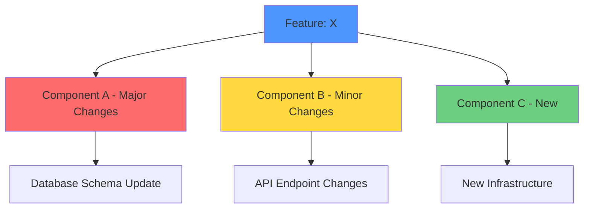

# Technical Impact Assessment: [Feature/Change Name]

**PM Author**: [Your Name]
**Created**: [Date]
**Last Updated**: [Date]
**Engineering Reviewer**: [Engineer Name]
**Status**: [Draft | Under Review | Approved]

---

## Executive Summary

**Feature**: [One sentence description]

**Feasibility**: [✅ Feasible | ⚠️ Complex | 🔴 Significant Challenge]

**Effort Estimate**: [Small (1-2 weeks) | Medium (3-6 weeks) | Large (2-3 months) | Very Large (6+ months)]

**Key Constraint**: [Primary technical limitation or blocker]

**Recommendation**: [Build Now | MVP Approach | Defer | Consider Alternative | Third-Party Solution]

**Confidence Level**: [High | Medium | Low] - [Reason for confidence level]

---

## Feature Breakdown

### What User Sees
[User-facing capabilities and experience]
- User action: [What user does]
- System response: [What user sees happen]
- Expected outcome: [Value delivered to user]

### What System Must Do
Behind the scenes requirements:

**Backend Requirements**:
- [Requirement 1]
- [Requirement 2]

**Data Requirements**:
- [What data needs to be stored/processed]
- [Data volume estimates]

**Integration Requirements**:
- [External services needed]
- [Internal services affected]

**Performance Requirements**:
- Response time: [Target, e.g., "< 200ms"]
- Throughput: [Target, e.g., "1000 req/sec"]
- Availability: [Target, e.g., "99.9% uptime"]

---

## Current State Analysis

### What We Have Today

**Existing Capabilities**:
- [Relevant existing feature 1]
- [Relevant existing feature 2]

**Infrastructure in Place**:
- [Component/service that can be leveraged]
- [Data/APIs that exist]

**Team Expertise**:
- [Relevant skills team has]
- [Similar features built before]

### What's Missing

**Net New Components Needed**:
- [New service/component 1] - [Why needed]
- [New infrastructure 2] - [Why needed]

**Gaps in Current Architecture**:
- [Gap 1] - [Why this prevents feature]
- [Gap 2] - [What would need to change]

**Skills/Knowledge Gaps**:
- [Technology/domain we lack experience in]

---

## Component Impact Map

### Components Affected

| Component | Impact Level | Changes Required | Risk Level | Estimated Effort |
|-----------|--------------|------------------|------------|------------------|
| [Name] | [High/Medium/Low] | [Description of changes] | [High/Medium/Low] | [Time estimate] |
| [Name] | [High/Medium/Low] | [Description of changes] | [High/Medium/Low] | [Time estimate] |

---

## Technical Feasibility Analysis

### ✅ Strengths (What Makes This Feasible)

1. [Positive factor 1]
   - **Evidence**: [Why we believe this]
   - **Impact**: [How this helps]

2. [Positive factor 2]
   - **Evidence**: [Why we believe this]
   - **Impact**: [How this helps]

### ⚠️ Challenges (What Makes This Difficult)

1. [Challenge 1]
   - **Why it's hard**: [Explanation]
   - **Mitigation**: [How to address]
   - **Impact if not addressed**: [Consequence]

2. [Challenge 2]
   - **Why it's hard**: [Explanation]
   - **Mitigation**: [How to address]
   - **Impact if not addressed**: [Consequence]

### 🔴 Blockers (What Prevents This Currently)

1. [Blocker 1]
   - **Why it blocks**: [Explanation]
   - **What's needed**: [What must be built/changed]
   - **Timeline to unblock**: [Estimate]

2. [Blocker 2]
   - **Why it blocks**: [Explanation]
   - **What's needed**: [What must be built/changed]
   - **Timeline to unblock**: [Estimate]

---

## Effort Estimation

### Engineering Effort Breakdown

| Discipline | Tasks | Effort | Engineers | Timeline |
|------------|-------|--------|-----------|----------|
| Backend | [Key tasks] | [Person-weeks] | [Number] | [Weeks] |
| Frontend | [Key tasks] | [Person-weeks] | [Number] | [Weeks] |
| Infrastructure/DevOps | [Key tasks] | [Person-weeks] | [Number] | [Weeks] |
| Data/Analytics | [Key tasks] | [Person-weeks] | [Number] | [Weeks] |
| QA/Testing | [Key tasks] | [Person-weeks] | [Number] | [Weeks] |

**Total Engineering Effort**: [X person-weeks] across [Y calendar weeks]

### Dependencies & Sequencing

**Critical Path**:
1. [Task 1] → [Task 2] → [Task 3]
   - **Blocker**: Can't start Task 2 until Task 1 complete
   - **Timeline**: [Weeks]

**Parallel Work Opportunities**:
- [Tasks that can be done simultaneously]

**External Dependencies**:
| Dependency | Owner | Status | Risk | Mitigation |
|------------|-------|--------|------|------------|
| [Third-party API access] | [Vendor] | [Pending/Approved] | [High/Med/Low] | [Backup plan] |
| [Design mockups] | [Design team] | [In progress] | [Low] | [Use low-fi mockups] |

---

## Risk Assessment

| Risk | Probability | Impact | Mitigation Strategy | Owner |
|------|-------------|--------|---------------------|-------|
| [Risk 1] | [High/Med/Low] | [High/Med/Low] | [How to prevent/handle] | [Person] |
| [Risk 2] | [High/Med/Low] | [High/Med/Low] | [How to prevent/handle] | [Person] |

### Top 3 Risks (Detailed)

**Risk 1: [Name]**
- **Probability**: [High/Medium/Low] - [Why]
- **Impact**: [High/Medium/Low] - [What happens]
- **Mitigation**: [Proactive steps]
- **Contingency**: [If risk materializes]
- **Early Warning Signs**: [What to watch for]

---

## Alternative Approaches

### Option A: [Approach Name] ⭐ RECOMMENDED

**Description**: [What this approach entails]

**Pros**:
- ✅ [Benefit 1]
- ✅ [Benefit 2]

**Cons**:
- ❌ [Drawback 1]
- ❌ [Drawback 2]

**Effort**: [Estimate]
**Timeline**: [Estimate]
**Cost**: [Estimate]

**When to Choose**: [Circumstances where this makes sense]

---

### Option B: [Approach Name]

**Description**: [What this approach entails]

**Pros**:
- ✅ [Benefit 1]
- ✅ [Benefit 2]

**Cons**:
- ❌ [Drawback 1]
- ❌ [Drawback 2]

**Effort**: [Estimate]
**Timeline**: [Estimate]
**Cost**: [Estimate]

**When to Choose**: [Circumstances where this makes sense]

---

### Option C: [Approach Name]

[Repeat structure]

---

### Trade-off Matrix

| Approach | Speed to Market | Engineering Effort | Quality/Capability | Cost | Risk |
|----------|----------------|-------------------|-------------------|------|------|
| Option A | [Fast/Med/Slow] | [Low/Med/High] | [Low/Med/High] | [$] | [Low/Med/High] |
| Option B | [Fast/Med/Slow] | [Low/Med/High] | [Low/Med/High] | [$] | [Low/Med/High] |
| Option C | [Fast/Med/Slow] | [Low/Med/High] | [Low/Med/High] | [$] | [Low/Med/High] |

---

## Recommended Approach

**Selected Option**: [Option X - Name]

### Rationale

**Why This Approach**:
1. [Key reason 1]
2. [Key reason 2]
3. [Key reason 3]

**Why Not Others**:
- **Option Y**: [Why rejected or deferred]
- **Option Z**: [Why rejected or deferred]

### Implementation Plan

**Phase 1: MVP (Week 1-X)**
- ✅ Include: [Core features]
- ❌ Exclude: [Non-essential features]
- 🎯 Success Criteria: [How we know MVP works]

**Phase 2: Enhancement (Week X-Y)**
- Features: [Additional capabilities]
- Success Criteria: [Goals for phase 2]

**Phase 3: Optimization (Week Y-Z)**
- Focus: [Performance, scale, polish]
- Success Criteria: [Final goals]

### MVP Scope Definition

**Must Have** (MVP won't work without):
- [ ] [Feature/capability 1]
- [ ] [Feature/capability 2]

**Should Have** (Important but can launch without):
- [ ] [Feature/capability 3]
- [ ] [Feature/capability 4]

**Could Have** (Nice to have, phase 2):
- [ ] [Feature/capability 5]
- [ ] [Feature/capability 6]

**Won't Have** (Explicitly out of scope):
- [ ] [Feature/capability 7]
- [ ] [Feature/capability 8]

---

## Cost Analysis

### Development Costs
- Engineering time: [Person-weeks × $ per week]
- Design time: [Person-weeks × $ per week]
- **Total Dev Cost**: [$X]

### Infrastructure Costs
| Component | Setup Cost | Monthly Cost (Current) | Monthly Cost (At Scale) |
|-----------|------------|------------------------|-------------------------|
| [Service] | [$X] | [$Y/month] | [$Z/month] |

**Total Infrastructure**: [$X setup] + [$Y/month recurring]

### Third-Party Service Costs
| Service | Pricing Model | Current | At 10K Users | At 50K Users | At 100K Users |
|---------|---------------|---------|--------------|--------------|---------------|
| [Name] | [Per user/request] | [$X] | [$Y] | [$Z] | [$W] |

### Total Cost of Ownership (3 Years)
- Year 1: [$X dev] + [$Y infrastructure] + [$Z services] = **[$Total]**
- Year 2: [$Y infrastructure] + [$Z services] = **[$Total]**
- Year 3: [$Y infrastructure] + [$Z services] = **[$Total]**

**3-Year TCO**: **[$Total]**

---

## Questions for Engineering

### Validation Questions
1. "What's the riskiest technical assumption in this plan?"
2. "What could we be missing that would significantly change the estimate?"
3. "Have we built anything similar before? What did we learn?"

### Scope Questions
4. "If we had to cut scope by 50%, what would you remove?"
5. "What's the simplest version that would deliver core value?"
6. "What features can we defer to Phase 2 without technical debt?"

### Alternatives Questions
7. "Are there creative technical shortcuts we haven't considered?"
8. "Could we use a third-party solution for parts of this?"
9. "What would make this 2x faster to build?"

### Risk Questions
10. "What keeps you up at night about this implementation?"
11. "What's most likely to cause delays or problems?"
12. "Where do we have knowledge gaps that need investigation?"

---

## Next Steps

### Before PRD
- [ ] Validate approach with engineering lead
- [ ] Confirm infrastructure cost estimates
- [ ] Get vendor pricing (if third-party integration)
- [ ] Review similar implementations for lessons learned
- [ ] Identify engineers to staff project

### Technical Spike (If Needed)
- **Duration**: [1-2 weeks]
- **Goal**: [Validate key technical assumption]
- **Deliverable**: [Proof of concept or report]
- **Decision Point**: [Go/No-Go criteria]

### For PRD Development
- [ ] Include technical approach summary from this assessment
- [ ] Document key constraints and trade-offs
- [ ] Reference this impact assessment in PRD
- [ ] Define technical success criteria
- [ ] Include cost estimates in business case

### Immediate Actions
1. [Action 1 - Owner - Due Date]
2. [Action 2 - Owner - Due Date]
3. [Action 3 - Owner - Due Date]

---

## Appendix

### Technical Assumptions
1. [Assumption 1] - [How to validate]
2. [Assumption 2] - [How to validate]

### Reference Materials
- [Link to architecture docs]
- [Link to similar features]
- [Link to technical specs]
- [Link to competitive analysis]

### Change Log
| Date | Author | Changes |
|------|--------|---------|
| [Date] | [Name] | Initial assessment |
| [Date] | [Name] | Updated after eng review |

---

## Approval & Sign-off

**PM**: [Name] - [Date]
**Engineering Lead**: [Name] - [Date]
**Technical Accuracy Verified**: [Yes/No]

**Engineering Comments**:
[Any notes from engineering review]

**Approved to Proceed**: [Yes/No/Conditional]
**Conditions** (if conditional): [What needs to happen first]
